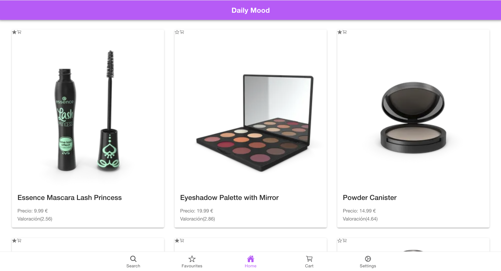
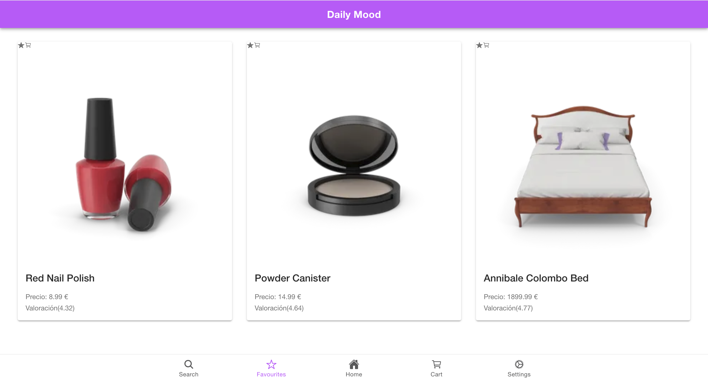
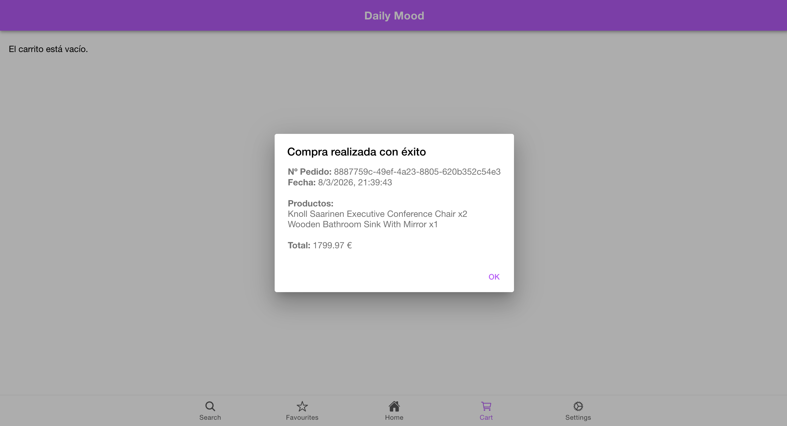
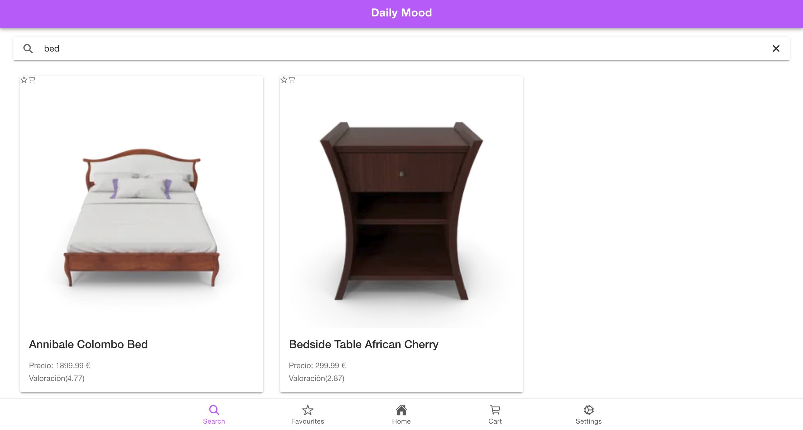
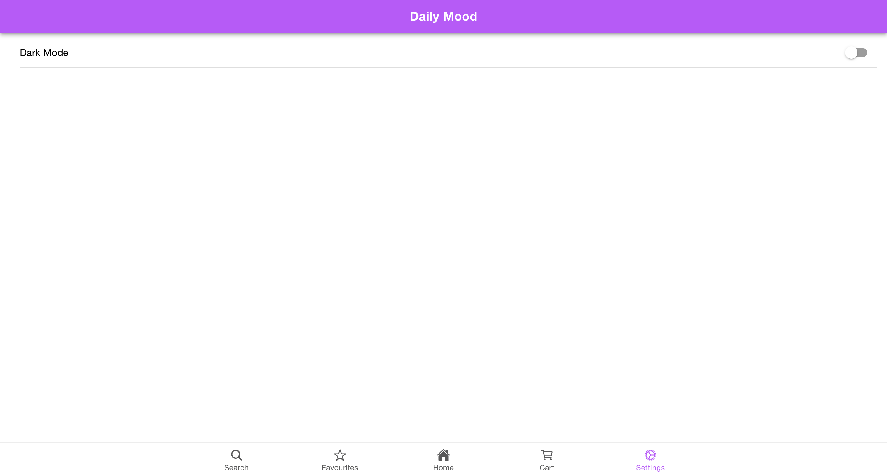

# ShoppingOnline – Ionic + Angular E-Commerce Application
A modern e-commerce mobile/web application built with Angular (standalone architecture) and Ionic Framework, featuring reactive state management using Angular Signals, simulated checkout processing, stock control, favorites management, and persistent cart functionality.

This project demonstrates clean architecture principles, reactive UI patterns, modular component design, and professional frontend engineering practices.

## Features
### Product catalog
1. Fetches products from a public API
2. Grid layout with responsive breakpoints
3. Product details page with full metadata
4. Reviews rendering
5. Currency formatting
6. Real stock display

### Favorites system
1. Add/remove products from favorites
2. Persistent storage via localStorage
3. Reactive state using Angular Signals
4. Favorites tab view

### Cart system
1. Add to cart from product card or detail page
2. Quantity increment/decrement
3. Stock limitation enforced
4. Disable add button when stock exhausted
5. Persistent cart state
6. Total price calculation (computed signal)
7. Total item count (computed signal)
8. Clear cart functionality

### Simulated checkout
1. Async checkout simulation (network delay)
2. Randomized payment failure simulation (10%)
3. Order ID generation
4. Order history persistence
5. Purchase confirmation alert with:
    - Order number
    - Purchase date
    - Product breakdown
    - Total price

### Order system
1. Local order persistence
2. Generated UUID per order
3. Order history stored in localStorage

### Search
1. Client-side filtering
2. Case-insensitive search
3. Reactive search bar component

### Theme toggle
1. Dark mode support
2. System preference detection
3. Manual toggle

### Persistent theme state
1. Mobile-First UI
2. Built with Ionic components
3. Tab-based navigation
4. Back button management
5. Responsive layout

## Architecture overview
This application follows a clean, modular structure:

```
src/app
│
├── interfaces/
│   └── product.ts
│
├── services/
│   ├── product.service.ts
│   ├── favourites.service.ts
│   ├── cart.service.ts
│   └── order.service.ts
│
├── components/
│   ├── product-card/
│   ├── product-list/
│   ├── detail/
│   ├── search-bar/
│   ├── header/
│   └── theme-toggle/
│
├── pages/
│   ├── home/
│   ├── search/
│   ├── favourites/
│   ├── cart/
│   ├── settings/
│   └── details/
│
└── tabs/
```

## State management strategy
The app uses Angular Signals for reactive state:
- signal() for internal mutable state
- computed() for derived values (total price, total items, favorite status)
- asReadonly() to expose immutable state externally

This eliminates the need for external state libraries (e.g., NgRx) while maintaining reactive correctness.

## Data persistence
All persistent state is stored in localStorage:
- Favorites → favorites
- Cart → cart
- Orders → orders

No backend is currently implemented. The checkout process is simulated.

## Data source
Products are fetched from: https://dummyjson.com/products
The API returns full product metadata including:
- Title
- Description
- Category
- Price
- Rating
- Stock
- Reviews
- Images
- Dimensions
- SKU
- Warranty
- Shipping info

## Tech stack
1. Angular (Standalone Components)
2. Ionic Framework
3. TypeScript
4. RxJS (for HTTP)
5. Angular Signals
6. CSS Animations
7. localStorage persistence

## UI / UX enhancements
1. Animated cart icon when adding product
2. Stock-aware disabled add button
3. Purchase confirmation modal
4. Loading spinners
5. Responsive grid
6. Clean component separation
7. Computed totals in real-time

## Simulated backend behavior
1. The checkout process simulates:
2. Network latency (1.5 seconds)
3. Random payment failure (10%)
4. Server-generated order ID
5. Order timestamp
6. Persistent order history

This mimics real backend flow without implementing MongoDB or REST APIs.

## Installation

1. Clone the repository
```bash
git clone https://github.com/AdrianMalmierca/DailyMood
```

2. Acces to the directory
```bash
cd DailyMood
```

3. Install dependencies
```bash
npm install
```

4. Run development server
```bash
ionic serve
```

Or using Angular CLI:
```bash
ng serve
```

## Build for production
```bash
ionic build
```

## Demostration

### Home page
Here there's the list with all the products recovered from the API.

In the product card you can add to favourites or to the card.


### Favourites page
Here are the products added to favourites


In case you don't hace any product added to favourites, you'll a message saying there's no products.


### Cart page
Here are the products added to the cart


When you click on the button to buy, you'll see the message with the order id, the date, the product and the total


In case you don't hace any product added to the cart, you'll a message saying there's no products.


### Search page
Here you can search the product by their name, showing all the matches.


### Settings page
Here there's the option to change the color to dark/white


## Important configuration
To allow HTML rendering inside Ionic alerts (used in checkout confirmation), ensure this is enabled in main.ts:

provideIonicAngular({
  innerHTMLTemplatesEnabled: true
})

## Key engineering decisions
1. Why Angular Signals?
    - Lightweight reactive state
    - Eliminates boilerplate
    - Modern Angular best practice
    - Suitable for small-to-medium scale apps

2. Why localStorage?
    - Simple persistence layer
    - Ideal for frontend-only architecture
    - No backend required for portfolio demonstration

3. Why simulated checkout?
    - Demonstrates async flows
    - Shows domain separation (Cart vs Order)
    - Mimics production logic without backend overhead

## Potential Future Improvements
1. JWT-based authentication
2. Real backend (Node + Express + MongoDB)
3. Server-side stock validation
4. Payment gateway integration (Stripe)
5. Order history page
6. Route guards
7. HTTP interceptors
8. Environment-based API config
9. Unit and integration testing
10. Clean Architecture layering (Domain / Application / Infrastructure)

## Learning outcomes demonstrated
This project showcases:
- Modern Angular development (v16+ patterns)
- Component-driven architecture
- State management using Angular Signals
- Reactive UI updates
- Async flow handling
- Clean service separation
- Realistic e-commerce domain modeling
- UX enhancements
- Production-ready structure
- Scalable frontend architecture
- Lightweight reactive state management

## Problem it solves
Modern e-commerce applications require:
- Reactive state management
- Persistent cart and favorites
- Stock control
- Clean navigation
- Mobile-first UX
- Separation of concerns
- Scalable architecture without unnecessary complexity

This application solves the following problems:

### Stateless UI vs persistent shopping experience
Users expect their cart and favorites to persist across sessions.

The app implements persistent state using localStorage synchronized with Angular Signals.

### Reactive UI without heavy state libraries
Instead of using complex state management solutions (e.g., NgRx), the app demonstrates how Angular Signals can handle:
- Global cart state
- Favorites management
- Derived values (total price, item count)
- UI auto-updates

This reduces boilerplate while maintaining reactivity.

### Stock integrity in frontend applications
The cart system enforces real stock limits, preventing users from exceeding available inventory.

### Separation of domain logic from UI
Business logic (cart, favorites, orders) is fully encapsulated in services.

Components remain presentation-focused and reusable.

### Realistic checkout flow without backend
The app simulates:
- Network delay
- Payment processing
- Random failure
- Order generation
- Purchase confirmation

This mimics real production behavior without requiring backend infrastructure.

### Mobile-First E-Commerce Experience
Built with Ionic, the application delivers a responsive, tab-based navigation model suitable for:
- Web
- Android
- iOS (via Capacitor)

## Technologies Used

### Frontend Framework
Angular
- Angular Signals
- Computed state
- Dependency Injection
- Angular Router
- HttpClient

### UI Framework
Ionic Framework
- Mobile-first components
- Tab navigation
- IonAlert, IonGrid, IonCard, IonSpinner
- Dark mode support

## State Management
- Angular Signals (signal, computed, asReadonly)
- Service-based reactive store pattern
- LocalStorage persistence layer

## Data Source
DummyJSON public API
(https://dummyjson.com/products
)

Used for fetching product catalog and metadata.

## Styling & UX
- CSS animations (cart feedback)
- Responsive grid system
- Currency formatting
- Conditional rendering
- Dark mode toggle

## Architecture Principles
- Component-driven design
- Domain separation
- Encapsulated business logic
- Reactive UI updates
- Stateless presentation layer
- Simulated infrastructure layer (orders)

## What did I learn?
I have learned how to create an app with Angular and Ionic. Ionic is a framework to create mobile/web apps, but until now I have only created apps for web or apps for mobile. So with this app I have learned and understand how Ionic works, the components of the framework like "ion-button". Although if you know how to programme in Angular is not hard to undestand Ionic, I have loved do this project and I want to keep working on it to make it better, with more functionalities. I also like how you can choose the type of project while you're creating it, cause in native Angular you have to create manually the tab meanwhile in Ionic you can choose it and I really like how it looks, I feel Ionic makes easier the job.

## Author
Adrián Martín Malmierca

Computer Engineer & Mobile Applications Master's Student